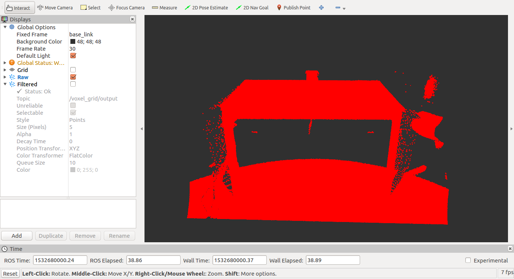
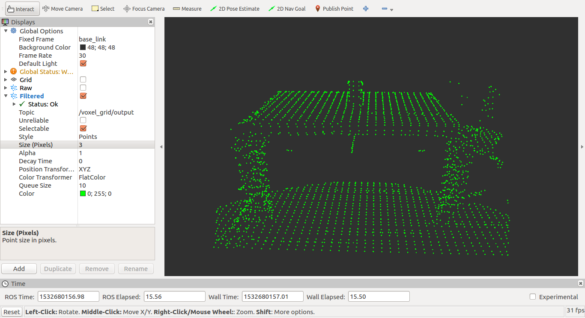
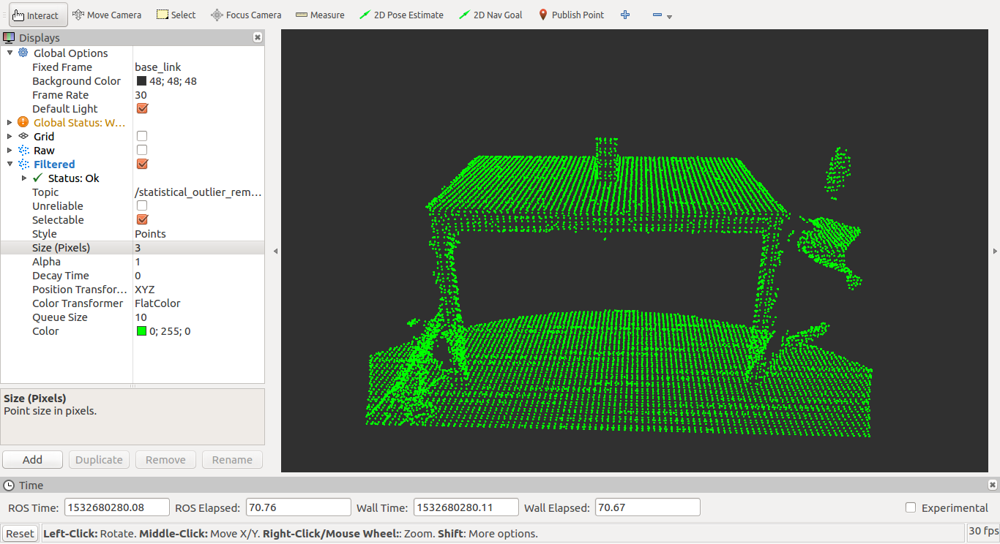

# 3D Point Cloud Processing and Filtering #

My internship project in Ravinspect. Filtering point cloud data coming from ZED camera.

Point Cloud Library (PCL) used on ROS platform.

## Sample Cloud Filtering

### Raw Point Cloud

### Downsampling with "Voxel Grid Filter"

### Removing noise with "Statistical Outlier Removal Filter"

## Author

* **Enes Demirağ** - *[LinkedIn](https://www.linkedin.com/in/enesdemirag/)*

## License

This project is licensed under the MIT License - see the [LICENSE.md](LICENSE.md) file for details.
